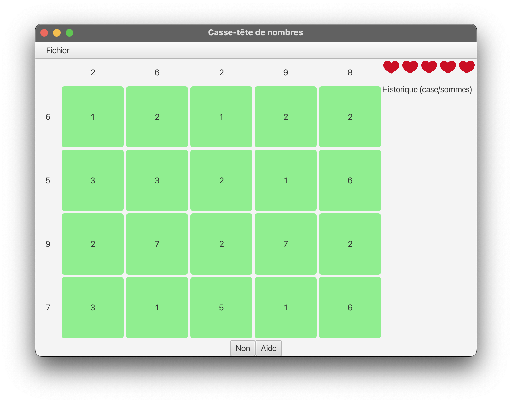
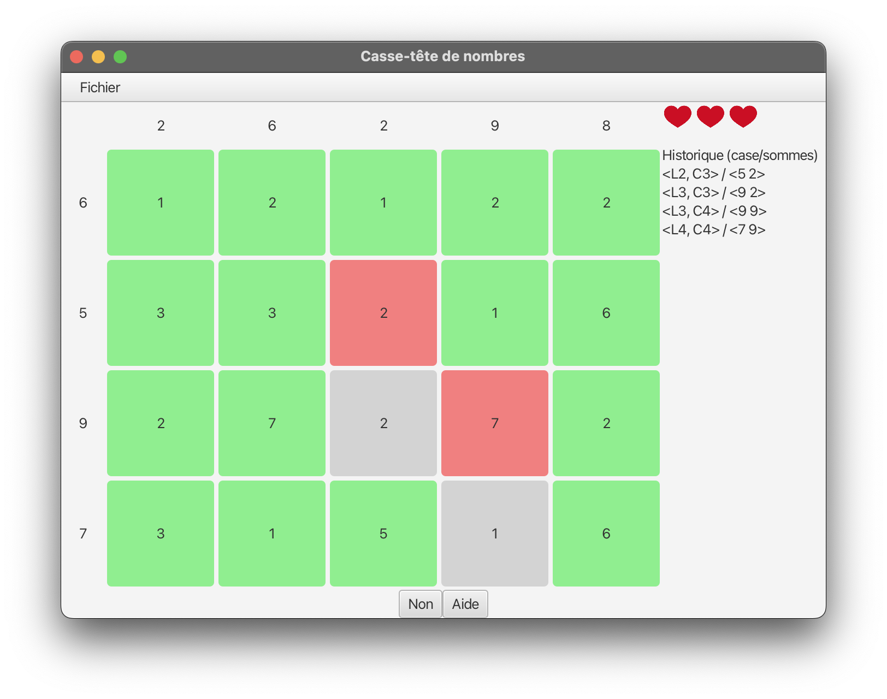

# CheckSommes - Number Puzzle Game

<div align="center">
  
  
</div>

## Introduction

**CheckSommes** is a logic puzzle game built with JavaFX that challenges players to identify specific numbers in a grid based on row and column sum constraints. The game combines strategic thinking with mathematical reasoning, offering an engaging gameplay experience where every choice matters.

This project was developed as part of my university coursework, demonstrating practical application of object-oriented programming principles, the Model-View-Controller (MVC) pattern, and JavaFX GUI development.

## About the Game

### Concept

CheckSommes presents players with a grid of numbers where certain cells are part of the solution. Your objective is to identify which cells belong to the solution set by analyzing the sum of values in each row and column. The game features two modes:

- **"Yes" Mode**: Select cells you believe are part of the solution
- **"No" Mode**: Select cells you believe are NOT part of the solution

### Gameplay Mechanics

- **Lives System**: You start with 5 lives. Making incorrect choices costs you lives
- **Dynamic Feedback**: Selected cells change color based on correctness:
  - 🟢 **Green**: Unselected cells
  - 🔴 **Coral**: Correctly identified solution cells
  - ⚪ **Gray**: Incorrectly selected cells
- **Sum Display**: Real-time calculation of row and column sums helps guide your decisions
- **Help Feature**: Stuck? Use the help button to reveal a non-solution cell (costs 2 lives)
- **Move History**: Track all your moves throughout the game
- **Custom Levels**: Load custom puzzle configurations from text files

### Win/Lose Conditions

- **Win**: Find all solution cells before running out of lives
- **Lose**: Lives reach zero before completing the puzzle

## Technical Challenges

### 1. Observer Pattern Implementation
One of the key architectural challenges was implementing a robust observer pattern to keep the UI synchronized with the game state. The `Jeu` class notifies multiple observers (`PlateauGraphique`, `Infos`, `Historique`) whenever the game state changes, ensuring real-time updates across all UI components.

### 2. State Management
Managing the complex state of the game, including cell states, move history, lives, and game modes, required careful design to prevent inconsistencies and ensure proper game flow.

### 3. File Parsing
Implementing a flexible file parser to load custom puzzle configurations from text files involved handling various edge cases and validating input data to prevent runtime errors.

### 4. Color-Coded Visual Feedback
Creating an intuitive visual system that provides immediate feedback on player choices required careful consideration of color theory and user experience principles.

## Technologies Used

- **Java 17**: Modern Java features including switch expressions and enhanced type inference
- **JavaFX 17.0.11**: Complete GUI framework for building the game interface

## How to Run

### Prerequisites
- **Java Development Kit (JDK) 17** or higher
- **JavaFX SDK 17.0.11** (download from [openjfx.io](https://openjfx.io/))

### Download
Download the latest `CheckSommes.jar` from the [GitHub Releases](https://github.com/ayoubdlf/CheckSommes/releases) page.

### Running the Application

```bash
java --module-path [path/to/javafx-sdk-17.0.11/lib] \
     --add-modules javafx.controls,javafx.fxml \
     -jar CheckSommes.jar
```

## Custom Puzzle Format

You can create custom puzzles using text files with the following format:

```
5 5
1 2 *3 4 5
*6 7 8 9 *10
11 *12 13 14 15
16 17 *18 19 20
*21 22 23 *24 25
```

- First line: `rows columns`
- Following lines: grid values (use `*` prefix to mark solution cells)